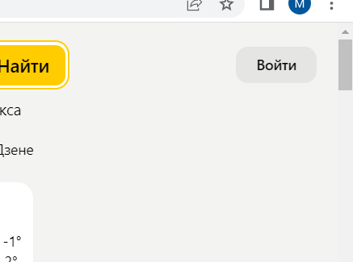

# Задача

На основе сайти [yandex.ru](https://dzen.ru/?yredirect=true):

1. Определите, на каком протоколе работает сайт.
2. Проанализируйте структуру страницы сайта.
3. Внесите не менее 10 изменений на страницу с помощью инструмента разработчика и представьте скриншоты было/стало.
4. Создайте прототип низкой детализации.

## Ответы

1. Сайт работает на защищённом протаколе https.
2. При переходе по ссылке откроется Дзен. Тут мы видим, что в шапке находится строка поиска Яндекса, в правом верхнем углу кноака входа, которая будет висеть в углу при пролистовании страницы вниз. Так же под стракой поиска находятся "ролики", "видео", "поиск в дзене". Дальше при пролсмотре страницы шапка будет сопровождать в верхнем левом углу (летна, видео, ролики, интересное, войти в канал). При открытии страницы, помимо шапки, нам сразу предоставляется возможность увидеть массу другой информации, которая находится в контенте. А именно: блок с новостями, погодой, курсом валют, актуальной рекламой и блок о путешествиях. Далее листая страницу в низ будут показываться основной контент, который нас интересует и который мы выбрали. Подвал же не велик и кратен. При пролистовании страницы постоянно находится в нижнем правом углу.

3. Изменения

Было 

Стало 

***

Было

Стало

***
Было

Стало

***
Было

Стало

***
Было

Стало

***
Было

Стало

***
Было

Стало

***
Было

Стало

***

4. Прототип низко детализации сайта с фильмами.

